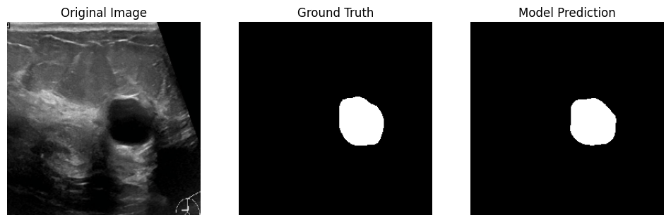

# Breast Cancer Segmentation using U-Net
This project implements a deep learning pipeline for the **segmentation of breast ultrasound images** using the U-Net architecture. The goal is to precisely delineate tumor regions (malignant and benign) from ultrasound scans.

## Project Overview
The model is trained on the **BUSI (Breast Ultrasound Images) dataset**. It utilizes a Hybrid Loss function (Dice + BCE) to handle the class imbalance typical in medical imaging, where the tumor often occupies a small fraction of the total image area.

### Key Features:
* **Architecture:** U-Net with a **ResNet-34** backbone (Pre-trained on ImageNet).
* **Augmentation:** Advanced pipeline using `Albumentations` (Rotation, Flipping, Scaling) to prevent overfitting.
* **Performance Metric:** Dice Similarity Coefficient (DSC).
* **Framework:** PyTorch & Segmentation Models PyTorch (SMP).

##  Dataset Structure
The project expects the BUSI dataset with Ground Truth (GT) masks organized as follows:
```text
Dataset_BUSI_with_GT/
├── benign/      # Images + _mask.png files
├── malignant/   # Images + _mask.png files
└── normal/      # Images + _mask.png files
```

##  Results & Visualization
The model demonstrates high precision in localizing tumor boundaries. Below are sample results from the test set (unseen data):

| Original Image | Ground Truth | Model Prediction |
| :--- | :--- | :--- |
|  |  |  |

> **Note on Model Learning:** In early epochs or complex "Normal" cases, the model might produce empty masks (Black predictions) as it prioritizes reducing false positives before fine-tuning on subtle textures.

##  Installation & Usage
1.  **Clone the repository:**
    ```bash
    git clone https://github.com/your-username/breast-cancer-segmentation.git
    ```
2.  **Install Dependencies:**
    ```bash
    pip install torch opencv-python segmentation-models-pytorch albumentations matplotlib tqdm
    ```
3.  **Run Training:**
    Update the `DATA_PATH` in the script and execute:
    ```bash
    python breast_cancer_segmentation.py
    ```

##  Future Improvements
* [ ] Experiment with **Attention U-Net** for better focus on small tumors.
* [ ] Implement **K-Fold Cross-Validation** for more robust evaluation.
* [ ] Deploy the model using **Streamlit** for a web-based diagnostic tool.

